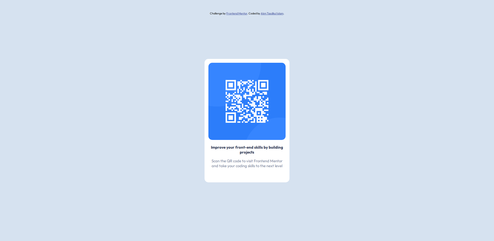

# Frontend Mentor - QR code component solution

This is a solution to the [QR code component challenge on Frontend Mentor](https://www.frontendmentor.io/challenges/qr-code-component-iux_sIO_H). Frontend Mentor challenges help you improve your coding skills by building realistic projects. 

## Table of contents

- [Overview](#overview)
  - [Screenshot](#screenshot)
  - [Links](#links)
- [My process](#my-process)
  - [Built with](#built-with)
  - [What I learned](#what-i-learned)
- [Author](#author)


**Note: Delete this note and update the table of contents based on what sections you keep.**

## Overview

### Screenshot



### Links

- Solution URL: [https://github.com/akmtasdikulislam/qr-code-component](https://github.com/akmtasdikulislam/qr-code-component)
- Live Site URL: [https://akmtasdikulislam.github.io/qr-code-component/](https://akmtasdikulislam.github.io/qr-code-component/)

## My process

### Built with

- HTML5
- CSS3


### What I learned

I mainlly learned how to build a card component with an image. I also learnt how to position an element center to the page.

To center an element to the page.

```css
.card{
        position: absolute;
      top: 50%;
      left: 50%;
      transform: translate(-50%, -50%);
}
```

## Author

- Website - [Akm Tasdikul Islam](http://www.tasdikul.rf.gd)
- Frontend Mentor - [@akmtasdikulislam](https://www.frontendmentor.io/profile/akmtasdikulislam)
- Twitter - [@Akm_Tasdikul](https://www.twitter.com/Akm_Tasdikul)

